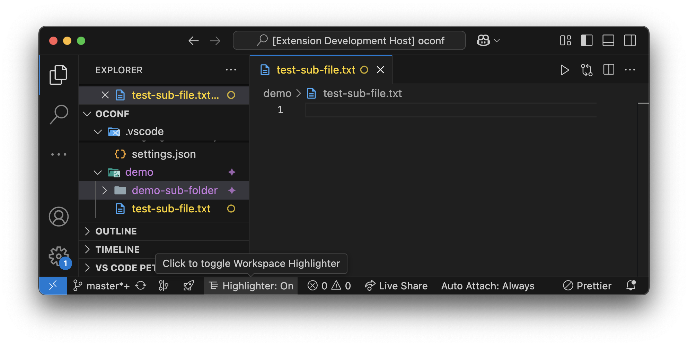
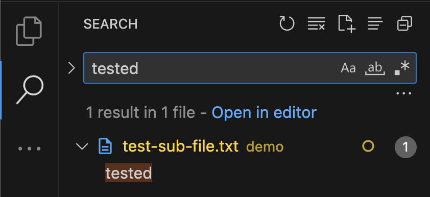
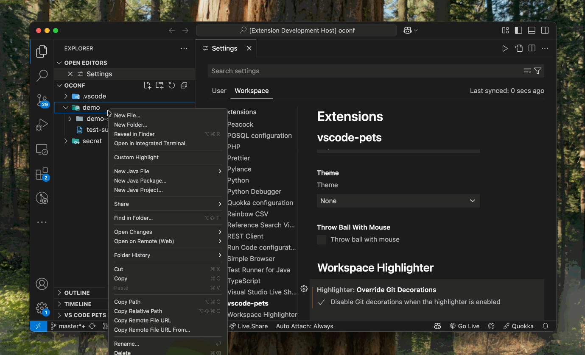
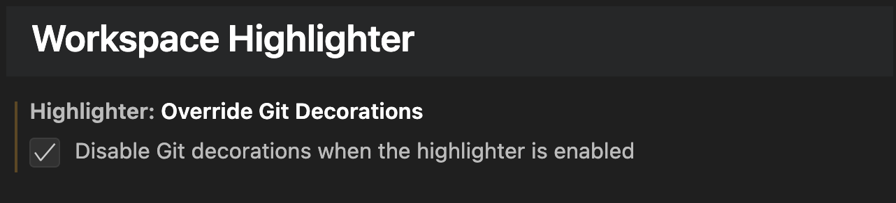

# WorkSpace Tree File Highlighter

**Workspace Tree File Highlighter** is a Visual Studio Code extension that allows you to highlight your project’s files and folders with custom colors and badges. Organize your workspace at a glance with custom decorations in the Explorer and editor tabs.

## Features

- **Toggle Highlights:**  
  Enable or disable file/folder highlighting via a status bar icon or command palette.
    
- **Custom Decorations:**  
  Apply custom colors and badges to files and folders. Customize highlights using a QuickPick menu. 
  Decorations are even propogated to window titles and search results! 
    
- **Inheritance-Aware:**  
  Highlights applied to parent folders propagate to children unless overridden.
- **Workspace-Specific Settings:**  
  All settings, including `highlighter.overrideGitDecorations`, are stored per **workspace**.

## Extension Settings

This extension contributes the following settings, please not they are **workspace** specific only:

* `highlighter.overrideGitDecorations`: This option allows to disable the Git decorations when the extension is enabled.

  

## Known Issues

- Moving `highlighter.enable` to be a `configuration` setting
- Improving the structure of how properties are defined

## Release Notes

Users appreciate release notes as you update your extension.

### [0.0.1](https://github.com/abduwaly-cmd/vscode-workspace-tree-file-highlighter/releases/tag/v0.0.1)

Beta release of the extension; which had the core features only; ranging from coloring directories / sub-directories to assigning certain tags to them.

---

